# _**Entrenamiento de una IA para clasificación de imágenes para una tienda de ropa**_

## _Generalidades_

*Integrantes* | *Código*
-|-
Carlos Manuel Ábrego Martínez|USIS044220
William Alexander Amaya García|USIS032120
José Daniel Mejía Jovel|USIS010420
Elías Mauricio Parada Lozano|USIS030320

### Instrucciones

> En grupos de trabajos, entrenar una red neuronal, tal cual se ha realizado en la semana 10 y 11, con articulos de ropa, para esto se debe utilizar el dataset de __fashion_mnist__, seguidamente hacer un video en el que se realizen pruebas con 10 imagenes por cada etiqueta.

### Vídeo y documento en colaboratory

*Recurso*|*Enlace*
-|-
Vídeo|[TiendaIA.mp4](https://drive.google.com/file/d/1HgHWeZo_jbx5Am9yvFM8sAALjZQDotN0/view?usp=sharing)
Documento|[AI_Fashion_mnist.ipynb](AI_Fashion_mnist.ipynb)

## _Realización_

Para realizar nuestra inteligencia artificial primero importamos aquellas liberias que se utilizarán, estas son:
- Tensorflow
- Matplotlib.pyplot
- Numpy
- Math
- Tensorflow_dataset
- cv2

Seguidamente se realiza el mismo procedimiento que el de la semana 10 y 11, con el dataset de **mnist**, únicamente cambiaremos de **mnist** a **fashio_mnist** y cambiaremos los datos de nuestro array **tags** que contiene las etiquetas de las imagenes.

```Python
import tensorflow as tf
import matplotlib.pyplot as plt
import numpy as np
import math
import tensorflow_datasets as dts
import cv2

dataset, metedata = dts.load('fashion_mnist', as_supervised=True, with_info=True)
dataTrain, dataTest = dataset['train'], dataset['test']

tags = ["Camiseta", "Pantalón", "Sueter", "Vestido", "Abrigo", "Sandalia", "Camisa", "Zapatilla", "Bolso", "Bota"]
```

El resto del código sera el mismo que el visto en las clases

## _Probando la AI_

Una vez hemos creado y entrenado nuestra inteligencia artificial, procedemos a realizar pruebas para porder asegurarnos de que funciona.

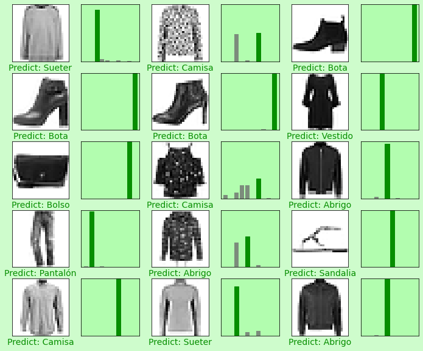

De lo anterior podemos comprobar que nuestra inteligencia artificial "cumple la chamba".

## _Realizando pruebas con imagenes locales_

Una vez hemos terminado nuestra AI y corroborado que esta funcione, la probaremos con imagenes que nosotros ingresaremos, pero primero.

### _Código_

Lo primero que haremos será subir la imagen, para esto haremos uso de la libreria cv2, y subimos la imagen en escala de grises, lo que se consigue colocando ", 0" seguido de la ruta de la imagen, seguidamente normalizaremos la imagen tal cual se hace con las imagenes del dataset, la última línea de código se realiza para evitar errores, pues al subir imagenes en escala de grises se elimina el ,1 de la imagen, y con esta línea lo recuperamos, al menos eso sucede con la libería cv2.

```Python
imgLocal = cv2.imread('/content/shirt.png', 0)
imgLocal = tf.cast(imgLocal, tf.float32)
imgLocal = imgLocal / 255
imgLocal = np.expand_dims(imgLocal, axis=0)
```

Ahora realizamos una predicción, almacenamos la respuesra en **prdLocal** y almacenamos el argumento mayor del array en **tagLocalTest**.

```Python
prdLocal = model.predict(imgLocal, batch_size=1)
tagLocalTest = np.argmax(prdLocal)
```

Finalmente imprimiremos la imagen y la gráfica tal cual se ha echo antes, pero esta vez cambiamos algunos datos para que funcione.

```Python
columns = 2
rows = 2

plt.figure(figsize=(2*2*columns, 2*rows))
plt.subplot(rows, 2*columns, 2*0+1)
plt.grid(False)
plt.xticks([])
plt.yticks([])
plt.imshow(imgLocal[0,...], cmap=plt.cm.binary)
plt.xlabel("Predict: {}".format(tags[tagLocalTest]), color='#068E00')

grafLocalSubplt = plt.subplot(rows, 2*columns, 2*0+2)
plt.grid(False)
plt.xticks([])
plt.yticks([])
thisplot = plt.bar(range(10), prdLocal[0], color='#7C8C7C')
plt.ylim([0,1])
grafLocalSubplt.set_facecolor("#B2FDAF")
thisplot[tagLocalTest].set_color("#A70000")
thisplot[tagLocalTest].set_color("#068E00")
plt.xticks(range(10), tags, rotation=90)

plt.rcParams['figure.facecolor'] = '#CEFCCC'
plt.rcParams['font.size'] = 14
plt.show()
```

### _Resultados_

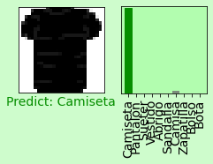 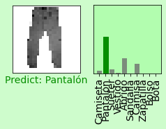
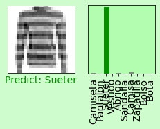 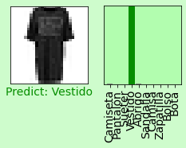
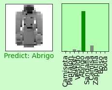 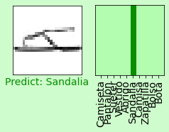
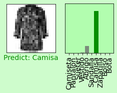 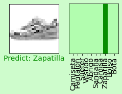
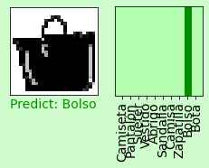 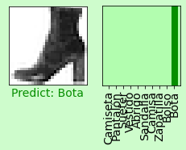
