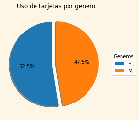

# _**Utilización de tarjetas de crédito**_

## Archivo completo
#### Archivo de colab: [CreditCards.ipynb](CreditCards.ipynb)

## Uso de tarjetas de crédito según su sexo
> Generar un gráfico del uso de las tarjetas de crédito según el genero y un documento en excel.

Imagen | Archivo
------------ | -------------
 | [Credit_Card_For_Gender.xlsx](Credit_Card_For_Gender.xlsx)

## Tipo de tarjetas de crédito por ciudad
> Generar un gráfico del tipo de trajetas y las ciudades que hay y generar un documento en excel.

Imagen | Archivo
------------ | -------------
 | [Card_Type_For_City.xlsx](Card_Type_For_City.xlsx)

## Tarjetas de crédito según su utilización
> Generar un gráfico de los distintos gastos que se realizan con las tarjetas de credito, y un archivo de excel.

Imagen | Archivo
------------ | -------------
 | [Credit_Card_For_Use.xlsx](Credit_Card_For_Use.xlsx)
