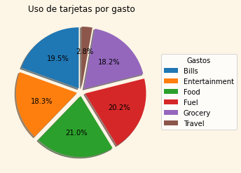

# Utilización de tarjetas de crédito

## Archivo completo
```
Archivo y enlace al documento de colab.
```
[Enlace colab: ](CreditCards.ipynb)

## Uso de tarjetas de credito segun su sexo
```
Generar un gráfico del uso de las tarjetas de crédito según el genero y un documento en excel.
```

[Archivo excel: Credit_Card_For_Gender.xlsx](Credit_Card_For_Gender.xlsx)

## Tipo de tarjetas de crédito por ciudad
```
Generar un gráfico del tipo de trajetas que hay por ciudad y generar un documento en excel.
```

[Archivo excel: Card_Type_For_City.xlsx](Card_Type_For_City.xlsx)

## UTarjetas de credito segun su utilización
```
Generar un gráfico de los distintos gastos que se realizan con las tarjetas de credito, y un archivo de excel.
```

[Archivo excel: Credit_Card_For_Use.xlsx](Credit_Card_For_Use.xlsx)
